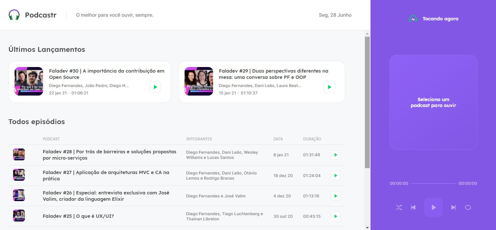
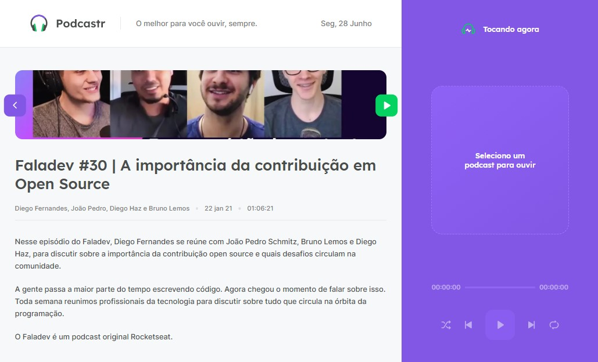
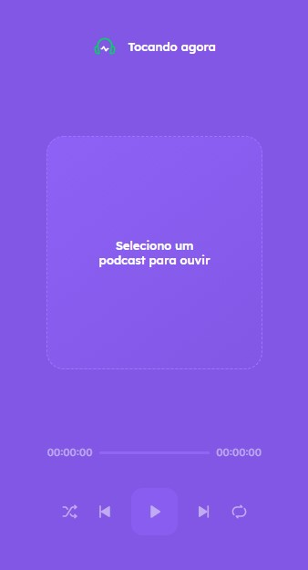

<h1 align="center">
   
</h1>

## Índice

- [1. Introdução](#1-introdução)
- [2. Podcastr](#2-podcastr)
- [3. Estrutura e funcionalidades](#3-estrutura-e-funcionalidades)
- [4. Ferramentas Utilizadas](#4-ferramentas-utilizadas)
- [5. Considerações Finais](#5-considerações-finais)
 ---
 

## 1. Introdução
Aplicação Web desenvolvida durante a trilha de estudos da NLW 5, promovida pela <strong>[Rocketseat](https://rocketseat.com.br/)</strong>.

---
 

## 2. Podcastr
Desenvolvido para estudos de `Next`, `Typescript` e `Sass`, o projeto consiste em desenvolver uma aplicação Web para reproduzir PodCasts.

O servidor é estático e gerado através de `Json Server` - explicaremos mais abaixo, caso queira ver a aplicação rodando em seu computador, como estanicar a mesma - onde através de chamada de API reproduzimos capítulos de Podcast do Canal <strong>FalaDev</strong>.

Neste projeto podemos aprofundar um pouco os conhecimentos e as diferenças entre SPA, SSR e SSG, e porque são utilizadas.

---
 

## 3. Estrutura e funcionalidades
Este projeto consiste na construção de duas páginas, e um componente de player que fica fixo nas duas páginas e independe da navegação da mesma, ou seja, você pode estar navegando entre os episódios do PodCast enquanto estuta o ultimo lançada, ou o seu favorito.

<strong>Página Home</strong>

  

Como podemos ver na página <strong>Home</strong> encontramos todos os episódios constantes no servidor, dando enfase para os dois últimos lançamentos.
Atráves da página hoje você pode já colocar um episódio para tocar, como pode entrar na página de cada epísodio, onde terá mais informações sobre o mesmo.
 
 

<strong>Página Episódio</strong>

  

Nesta página você tem mais informações sobre o episódio selecionado, consegue voltar a página inicial ou iniciar a ouvir o episódio por essa página mesmo.
 
 

<strong>Player</strong>

  
  

O player é componente independente, você poderá navegar pelas páginas, que não influenciará na reprodução do conteúdo.

Ele inicia vazio, e assim que selecionado um episódio o mesmo inicia a tocar no player com algumas informações do episódio, como sua imagem, titulo, membros.

Através dele você consegue fazer a navagação através dos episódios, e todos os recursos que um player tem como, repetir episódio, e embaralhar os episódios para uma reproduação aleatória.

---
 

## 4. Ferramentas Utilizadas

As seguintes ferramentas foram usadas na construção do projeto:

- [x] NextJS
- [x] TypeScript
- [x] SASS
- [x] Json Server
- [x] Axios
- [x] React Router Dom

---
 

## 5. Considerações Finais
Desejar ver a aplicação rodando em seu computador, para o mesmo você precisa:
- [x] Dar um Fork nesse repositório;
- [x] Faça um clone do mesmo;
- [x] Não esqueça, `npm install` para intalar todas as dependencias;

Estamos prontos para decolar, <strong>ainda não</strong>, o servidor desse projeto é local, não esqueça de estanciar ele antes de estanciar o projeto:
- [x] verifiquei se no arquivo package.json o "server" está configurado;
- [x] `npm run server`;

Com seu servidor já rodando, agora é só dar um <strong>`npm run-script build`</strong>.

<strong>Pronto, agora é só curtir!</strong>

Obrigada ao time Rocketseat por essa trilha!

---

  <a href="https://github.com/kauanaagostini"> <b>Kauana Maria Agostini</b></a>

